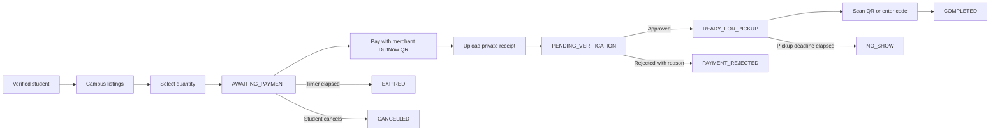
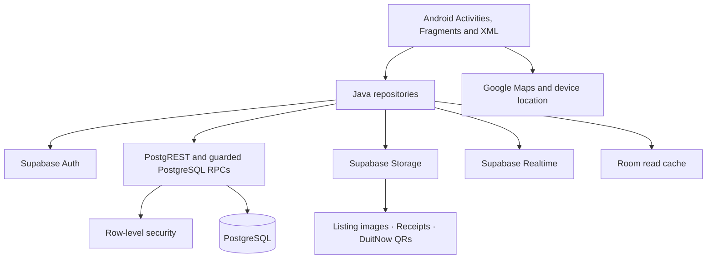

# 🍱 FoodHero

<div align="center">


### Rescue good food. Save money. Make every pickup count.

FoodHero connects verified university communities with campus merchants offering safe surplus meals—before good food becomes waste.

[](https://developer.android.com/)
[](https://openjdk.org/)
[](https://supabase.com/)
[](https://m3.material.io/)
[](#-quality-gates)
[](https://github.com/ChaiBoonHong/MAD_Group13_FoodHero/releases/tag/v1.0)
[](#-academic-declaration)

[Download APK (v1.0)](https://github.com/ChaiBoonHong/MAD_Group13_FoodHero/releases/tag/v1.0) · [Demo Accounts](#-demo-accounts-for-evaluation) · [Explore the journey](#-how-foodhero-works) · [Run the app](#-quick-start) · [Configure Supabase](#-supabase-setup) · [Test safely](#-quality-gates)

</div>

> [!IMPORTANT]
> FoodHero handles real identities, stock, orders, receipts, and pickup tokens. Never add fake-success responses, hard-coded users, service-role keys, or device-local `content://` paths as backend records.

## 🌱 Why FoodHero?

Campus food outlets can finish the day with safe unsold meals while students are searching for affordable food. FoodHero creates a trusted, campus-isolated rescue loop:

- Students get discounted meals priced at **RM10 or below**.
- Merchants recover value from food that may otherwise be wasted.
- Atomic reservations prevent the same stock from being sold twice.
- DuitNow QR keeps payment familiar for Malaysian users.
- Private receipts and single-use pickup tokens protect both parties.
- Completed rescues contribute to savings and environmental-impact totals.

## ✨ What can it do?

<details open>
<summary><strong>🎓 Student experience</strong></summary>

- Register using an exact supported institutional email domain.
- Confirm the email before entering the Student workspace.
- See only listings associated with the verified campus.
- Search, filter, inspect, favourite, and reserve available food.
- Select quantity while Supabase atomically validates and reduces stock.
- View the merchant's real DuitNow QR, payment reference, amount, and countdown.
- Save the QR to Gallery or share it to a compatible Android app.
- Upload a real payment receipt to private Supabase Storage.
- Track verification, rejection, pickup, cancellation, expiry, and completion.
- Present a single-use pickup QR and leave a review after collection.
- View real device location, campus listings, landmarks, and route estimates.

</details>

<details>
<summary><strong>🏪 Merchant experience</strong></summary>

- Register with any confirmed email address.
- Complete business information and accept the merchant terms.
- Select a campus and pin the stall location on the map.
- Upload the actual merchant DuitNow QR.
- Receive automatic approval only after the complete validated transaction succeeds.
- Create, edit, restock, and deactivate campus-bound listings.
- Use Supabase Storage or a validated external HTTPS listing image.
- Review private payment receipts for associated orders only.
- Approve a receipt or reject it with a required reason.
- Scan the pickup QR or enter the fallback code manually.
- View completed-order revenue, listings, reviews, and order activity.

</details>

<details>
<summary><strong>🔁 Dual-role accounts</strong></summary>

- One Supabase Auth user can hold both Student and Merchant roles.
- The last-used role controls routing after login.
- Both profile screens provide **Switch Role**.
- A Student can add Merchant access through merchant onboarding.
- A personal-email Merchant can add Student access by verifying a secondary institutional email with a hashed, expiring code.

</details>

## 🧭 How FoodHero works



### Order rules at a glance

| State | What the user sees | What may happen next |
|---|---|---|
| `AWAITING_PAYMENT` | DuitNow QR, reference, amount, countdown | Receipt upload, cancellation, or expiry |
| `PENDING_VERIFICATION` | Receipt is under merchant review | Approval or rejection |
| `READY_FOR_PICKUP` | Pickup QR and fallback code | Completion or no-show |
| `PAYMENT_REJECTED` | Merchant reason and released stock | Terminal |
| `COMPLETED` | Successful rescue and updated impact | Terminal |
| `CANCELLED` | Unpaid reservation cancelled | Terminal |
| `EXPIRED` | Payment window elapsed | Terminal |
| `NO_SHOW` | Paid order missed its pickup deadline | Terminal; no stock restoration |

Stock is restored exactly once for eligible rejection, cancellation, and payment-expiry transitions. It is not restored for `NO_SHOW`. Impact and merchant revenue update only on the first valid transition to `COMPLETED`.

## 🏗️ Architecture



The Android client never directly assigns trusted roles, affiliations, merchant approval, stock, revenue, impact totals, or terminal order states. Those decisions live in guarded database functions, triggers, constraints, grants, and RLS policies.

### Important backend operations

| Operation | Responsibility |
|---|---|
| `lookup_institution_domain` | Exact normalized institution matching |
| `switch_active_role` | Validated dual-role routing |
| `complete_merchant_registration` | Atomic onboarding and approval |
| `reserve_listing` | Campus validation, stock lock, order creation, expiry |
| `submit_payment_receipt` | Validated receipt transition |
| `decide_payment_receipt` | Merchant-only approval or rejection |
| `complete_pickup` | Merchant-only, single-use token consumption |
| `mark_no_show` | Idempotent missed-pickup transition |
| `reconcile_due_orders` | Server-authoritative expiry reconciliation |

## 🧰 Technology

| Layer | Tools |
|---|---|
| Mobile | Native Android, Java 11, XML, Material Components, AndroidX |
| Backend | Supabase Auth, PostgreSQL, PostgREST, Realtime, Edge Functions |
| Security | RLS, guarded RPCs, private Storage policies, expiring hashed codes |
| Networking | Retrofit 2, OkHttp, Gson |
| Local data | Room and encrypted preferences when supported |
| Media | Glide, Android MediaStore, Sharesheet |
| QR | ZXing and JourneyApps ZXing Embedded |
| Location | Google Maps SDK, Google Routes API, and Play Services Location |
| Background | WorkManager |
| Verification | JUnit, Mockito, AndroidX Test, Espresso, Android lint |

## 🗂️ Repository map

```text
MAD_Group13_FoodHero/
├── app/
│   ├── src/main/java/.../foodhero/
│   │   ├── data/
│   │   │   ├── local/          # Room database and cache
│   │   │   ├── model/          # Domain contracts
│   │   │   ├── remote/         # Auth, REST, Storage and Realtime
│   │   │   ├── repository/     # Application operations
│   │   │   └── session/        # Authenticated local session
│   │   ├── ui/                 # Activities, Fragments and adapters
│   │   └── util/               # QR, routing, workers and formatting
│   ├── src/main/res/            # Layouts, themes, menus and drawables
│   └── src/test/                # Local unit tests
├── supabase/
│   ├── functions/
│   │   └── request-institution-verification/
│   ├── schema.sql               # Consolidated backend contract
│   └── supabase_setup_guide.md
├── SPRINT_PLAN.md
├── secrets.properties.example
└── README.md
```

## 📦 Release & Demo Accounts

### 📲 Latest Release (v1.0)

Pre-built and signed APK is available on GitHub Releases:
- **GitHub Release Page:** [FoodHero v1.0](https://github.com/ChaiBoonHong/MAD_Group13_FoodHero/releases/tag/v1.0)
- **Direct APK Download:** [FoodHero-v1.0.apk](https://github.com/ChaiBoonHong/MAD_Group13_FoodHero/releases/download/v1.0/FoodHero-v1.0.apk)
- **Target OS:** Android 9.0+ (API 28+)

### 🔑 Demo Accounts for Evaluation

You can use the following pre-configured, tested accounts to evaluate both student and merchant roles:

#### 1. UTAR Student

```text
Email: demo.student@1utar.my
Password: FoodHeroStudent2026!
```

- **Role:** Student only
- **Institution:** UTAR
- **Campus:** UTAR Kampar
- **Student ID:** `DEMO-STUDENT-001`
- **Faculty:** FICT
- **Email confirmed:** Yes
- **Password login tested:** Successful

#### 2. UTAR Merchant

```text
Email: demo.merchant@utar.edu.my
Password: FoodHeroMerchant2026!
```

- **Role:** Merchant only
- **Institution:** UTAR
- **Campus:** UTAR Kampar Main Campus
- **Business:** UTAR Demo Food Stall
- **Email confirmed:** Yes
- **Password login tested:** Successful

## 🚀 Quick start

### Prerequisites

- Android Studio with Android SDK 36 support.
- JDK 17 or Android Studio's bundled runtime for Gradle.
- Android API 28+ emulator or physical device.
- A dedicated **development** Supabase project.
- Google Maps SDK, Google Routes API, billing, and the required OAuth configuration.
- Two physical phones for final Student ↔ Merchant acceptance testing.

### 1. Clone and configure

```bash
git clone <repository-url>
cd MAD_Group13_FoodHero
```

Create the untracked secrets file:

```powershell
Copy-Item secrets.properties.example secrets.properties
```

```properties
SUPABASE_URL=https://YOUR_PROJECT_REF.supabase.co
SUPABASE_ANON_KEY=YOUR_PUBLISHABLE_OR_LEGACY_ANON_KEY
MAPS_API_KEY=YOUR_RESTRICTED_ANDROID_MAPS_KEY
GOOGLE_WEB_CLIENT_ID=YOUR_GOOGLE_WEB_CLIENT_ID
```

> [!CAUTION]
> Never put `SUPABASE_SERVICE_ROLE_KEY` in the Android project, APK, screenshots, resources, or Git history.

### 2. Build

```powershell
.\gradlew.bat assembleDebug
```

macOS/Linux:

```bash
./gradlew assembleDebug
```

The APK is generated at `app/build/outputs/apk/debug/app-debug.apk`.

## ⚡ Supabase setup

1. Create or select the exact development/demo project.
2. Review and apply [`supabase/schema.sql`](supabase/schema.sql).
3. Require email confirmation in Supabase Auth.
4. Add the mobile redirect `foodhero://auth-callback`.
5. Configure Google as an identity provider if Google login is used.
6. Deploy `request-institution-verification` with JWT verification enabled.
7. Configure these Edge Function secrets:

   ```text
   RESEND_API_KEY
   VERIFICATION_FROM_EMAIL
   ```

8. Confirm Realtime publication for the required order, listing, and notification tables.
9. Run RLS tests with anonymous, Student, Merchant, dual-role, and cross-campus actors.

The institutional registry uses exact case-insensitive matching on the text after `@`. Deceptive suffixes such as `student.utar.edu.my.attacker.com` must fail.

### Storage buckets

| Bucket | Access | Content |
|---|---|---|
| `listing-images` | Public read, merchant-controlled write | Food listing photos |
| `payment-receipts` | Private | Student receipt evidence |
| `merchant-payment-qrs` | Private | Actual merchant DuitNow QR images |

External listing images remain an optional HTTPS alternative; they do not replace Supabase Storage.

## ✅ Quality gates

Run the local verification suite:

```powershell
.\gradlew.bat testDebugUnitTest assembleDebug lintDebug
git diff --check
```

Current local result: **unit tests, debug assembly, Android lint, and diff validation pass**.

<details>
<summary><strong>What still requires a real environment?</strong></summary>

- Schema execution and database-advisor results for the target Supabase project.
- RLS isolation across independent Student and Merchant accounts.
- Concurrent reservation and one-time stock restoration.
- Resend email delivery, cooldown, expiry, and retry limits.
- Real DuitNow app handoff and receipt review.
- Camera scan, manual pickup code, replay denial, and wrong-merchant denial.
- Maps, location, notification, Gallery, and Sharesheet permissions.
- Compact screens, keyboard safety, TalkBack, and 200% font scale.
- Process recreation and intermittent-connectivity behavior.

A successful Gradle build proves local compilation; it does not prove live Supabase or physical-device behavior.

</details>

## 🔐 Security promises

- Institutional eligibility is assigned server-side.
- Shared domains use the `member` affiliation where Student/Staff cannot be inferred safely.
- All commerce mutations use guarded PostgreSQL functions.
- Payment receipts are never public catalogue assets.
- Pickup tokens are opaque, high-entropy, single-use values.
- Unknown order statuses fail closed instead of becoming successful states.
- RLS prevents cross-account and cross-campus access.
- Storage paths are scoped to authenticated owners and order participants.
- The service-role key remains server-side only.

## 🧹 Safe demo reset

The reset is deliberately separate from app startup, APK installation, and schema deployment.

Before deleting anything:

- Confirm the exact development/demo Supabase project ID.
- Capture screenshots, videos, logs, and acceptance results.
- Delete user-generated rows in foreign-key-safe order.
- Remove listing photos, receipts, and merchant DuitNow QR objects.
- Revoke sessions and remove test Auth users through authorized tooling.
- Preserve institutions, domains, campuses, service areas, landmarks, buckets, RLS, functions, triggers, and migrations.
- Repeat empty-state and fresh-registration checks afterward.

> [!WARNING]
> Never run the reset against production or before acceptance evidence has been captured.

## 🩺 Troubleshooting

<details>
<summary><strong>Gradle reports missing configuration</strong></summary>

Confirm `secrets.properties` exists at the repository root and contains all four required values. Do not solve this by committing placeholder secrets.

</details>

<details>
<summary><strong>Google Sign-In returns error 10</strong></summary>

Verify the package name, signing SHA fingerprint, Android OAuth client, web client ID, and Supabase Google-provider configuration.

</details>

<details>
<summary><strong>The map is blank</strong></summary>

Confirm Maps SDK for Android is enabled and the API key restriction includes `com.uccd3223.group13.foodhero` and the current signing certificate.

</details>

<details>
<summary><strong>Supabase returns 401 or 403</strong></summary>

Check session expiry, project URL/key, email confirmation, profile creation, role membership, and RLS. Never bypass the problem by weakening RLS or embedding a service-role key.

</details>

<details>
<summary><strong>A merchant cannot open a receipt</strong></summary>

Confirm the receipt object exists, the order contains the correct Storage path, the access token is current, and the signed-in user owns the associated merchant record.

</details>

## 🤝 Contributing

1. Pull the latest shared branch and preserve unrelated contributor changes.
2. Create one focused branch for one logical change.
3. Keep Java 11 and XML compatibility.
4. Never commit passwords, tokens, receipts, private QRs, or local secret files.
5. Add tests for changed business rules.
6. Run all [quality gates](#-quality-gates).
7. Document schema, Storage, Auth, or Dashboard configuration changes.
8. Attach physical-device evidence for UI, maps, permissions, payments, and camera work.
9. Request review before merging security policies or shared schema changes.

Suggested commit style:

```text
feat: add campus-isolated merchant onboarding
fix: restore rejected-order stock exactly once
docs: refresh Supabase acceptance checklist
```

## 📚 Project documents

- [Implementation sprint plan](SPRINT_PLAN.md)
- [Supabase schema](supabase/schema.sql)
- [Supabase setup guide](supabase/supabase_setup_guide.md)

## 🎓 Academic declaration

FoodHero was developed by **Group 13** for the **UCCD3223 Mobile Applications Development** course at Universiti Tunku Abdul Rahman. Contributors are responsible for ensuring that submitted code, reports, screenshots, demonstrations, and Git history accurately represent their own work and verified results.

Unless the repository owner adds an explicit license file, this README does not grant an open-source license.

---

<div align="center">

### Small rescue. Shared impact. Better campus. 🌏

Made with care by FoodHero Group 13.

</div>
